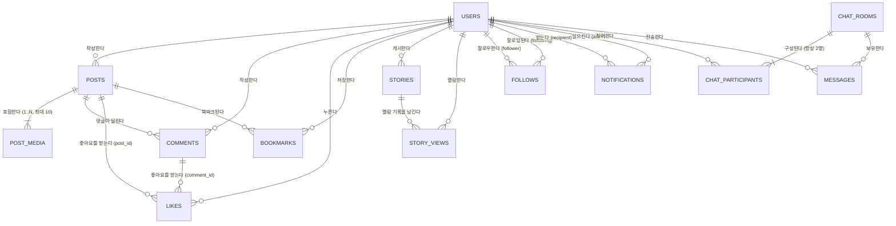

# 📸 Instagram 클론 데이터베이스 설계 명세서 (db.md)

본 문서는 Instagram 풀스택 클론의 데이터베이스 설계 및 스키마 명세서입니다. 로컬은 SQLite, 서버는 PostgreSQL이며 스키마는 Alembic 리비전 하나로 맞춘다.  
ORM으로는 Python의 **SQLAlchemy 2.0 (Declarative Base)**을 기준 모델로 정의하며, 마이그레이션 도구로 **Alembic**을 사용합니다.

---

> **2026-10-07 갱신**: 아래 내용은 실제 운영 중인 마이그레이션(`backend/alembic/versions/689ee5412b5f_initial_instagram_schema.py`)과 모델(`backend/app/models/*.py`)을 기준으로 다시 작성했다. 이전 버전에 있던 `hashtags`/`post_hashtags` 테이블과 알림 `MENTION` 타입, `messages.media_url`, `chat_rooms.room_name`은 **실제로 만들어지지 않는다** — 구현 범위는 `backend.md` 1.3절을 따른다. 실제 테이블은 13개뿐이다.

## 1. 개요 및 설계 원칙

1. **RDBMS**: 로컬은 SQLite3, 서버는 PostgreSQL. `ENV=local`이면 SQLite, `ENV=production`이면 PostgreSQL `DATABASE_URL`이 필수다.
   - SQLite만 `PRAGMA foreign_keys = ON;`, `PRAGMA journal_mode = WAL;`을 연결마다 실행한다.
   - PostgreSQL은 같은 규칙을 plpgsql 트리거로 적용한다. SQLite 트리거 문법은 서버에서 실행하지 않는다.
2. **네이밍 규칙**:
   - 테이블명: 복수형 스네이크 케이스 (예: `users`, `posts`, `comments`)
   - 기본 키(PK): `id` (정수형 Auto-Increment). `chat_participants`, `story_views`는 복합 PK.
   - 외래 키(FK): `{단수형_테이블명}_id` (예: `user_id`, `post_id`)
   - 날짜/시간: UTC 기준 `created_at`, `updated_at` (SQLite `DATETIME`, `CURRENT_TIMESTAMP` 기본값)
   - **소프트 삭제 없음**: `is_deleted` 컬럼은 쓰지 않는다. 삭제는 `ON DELETE CASCADE`로 실제 행을 지운다. 계정은 삭제 대신 `users.is_active=false`로 끄는 경로(비활성화)가 따로 있다.
3. **무결성은 CHECK 제약과 트리거로 강제**: SQLite는 `VARCHAR(n)` 길이나 값 목록을 검사하지 않으므로, 길이·형식·상태값 제한을 전부 `CHECK` 제약(`ck_*`)으로 걸고, 다중 테이블에 걸친 규칙(1:1 방 중복 방지, 게시물 사진 10장 제한 등)은 `CREATE TRIGGER`(`trg_*`)로 강제한다. 목록은 4.11절 참고.
4. **정규화**: 다중 미디어(캐러셀) 지원을 위해 `posts`와 `post_media` 분리 (1:N). 좋아요는 게시물/댓글을 한 테이블(`likes`)에서 다형적으로 처리(둘 중 하나만 NULL이 아님).

---

## 2. ERD (Entity Relationship Diagram)



`hashtags`, `post_hashtags`, 댓글 대댓글 트리(실제 저장은 `parent_id`가 있으나 API가 항상 `NULL`로만 저장), `MENTION` 알림은 스키마에 컬럼/제약은 존재하거나(예: `comments.parent_id`) 일부 설계는 남아있지만 실제로 값이 채워지는 경로(API)가 없다. 자세한 내용은 각 테이블 설명 참고.

---

## 3. 테이블 상세 명세

### 3.1. `users` (사용자 테이블)
회원 계정 기본 정보, 인증 및 프로필 데이터를 관리합니다.

| 컬럼명 | 데이터 타입 | 제약 조건 | 설명 |
| :--- | :--- | :--- | :--- |
| `id` | INTEGER | PK, AUTOINCREMENT | 고유 식별자 |
| `username` | VARCHAR(30) | **UNIQUE**, NOT NULL, `ck_users_username` | 3~30자, 소문자/숫자/`_`/`.`만 허용 |
| `email` | VARCHAR(255) | NOT NULL, `ck_users_email_len`(3~255자) | 컬럼 자체는 UNIQUE가 아니다. 대소문자 무시 고유성은 아래 표현식 인덱스가 담당 |
| `phone` | VARCHAR(20) | NULL, `ck_users_phone`(1~20자) | 빈 문자열은 저장하지 않고 NULL로 바꿔 저장 |
| `hashed_password` | VARCHAR(255) | NOT NULL | bcrypt 해시 (`bcrypt.hashpw`, 72바이트 컷) |
| `full_name` | VARCHAR(100) | NULL, `ck_users_full_name`(1~100자) | 빈 문자열은 NULL |
| `bio` | TEXT | NULL | 자기소개 |
| `website` | VARCHAR(255) | NULL, `ck_users_website`(1~255자) | 프로필 표시 전용, 편집 화면에서 수정 안 함 |
| `profile_img_url` | VARCHAR(500) | NOT NULL, DEFAULT `/static/default_profile.png`, `ck_users_profile_img_len`(1~500자) | |
| `is_private` | BOOLEAN | DEFAULT FALSE, NOT NULL | 비공개 계정 여부 |
| `is_verified` | BOOLEAN | DEFAULT FALSE, NOT NULL | 인증 뱃지(블루마크) 여부 (시드 데이터용) |
| `hide_likes_by_default` | BOOLEAN | DEFAULT FALSE, NOT NULL | 새 게시물 작성 시 좋아요 숨김 초기값 |
| `is_active` | BOOLEAN | DEFAULT TRUE, NOT NULL | 비활성화(탈퇴 대신) 시 FALSE. 로그인 거부, 검색/피드/탐색/프로필에서 제외 |
| `created_at` | DATETIME | DEFAULT CURRENT_TIMESTAMP, NOT NULL | 가입일시 |
| `updated_at` | DATETIME | DEFAULT CURRENT_TIMESTAMP, NOT NULL | `trg_users_updated_at` 트리거가 값이 그대로일 때만 갱신 |

- **인덱스**:
  - `ix_users_username` — UNIQUE on `username`
  - `ix_users_email` — non-unique on `email`
  - `uq_users_email_lower` — **`UNIQUE(lower(email))`** 표현식 인덱스 (SQL로 직접 생성). 대소문자만 다른 이메일 중복 가입을 막는 실질적인 유니크 키다.

---

### 3.2. `posts` (게시물 테이블)
인스타그램 피드 게시물의 텍스트 캡션 및 메타데이터를 저장합니다.

| 컬럼명 | 데이터 타입 | 제약 조건 | 설명 |
| :--- | :--- | :--- | :--- |
| `id` | INTEGER | PK, AUTOINCREMENT | 고유 식별자 |
| `user_id` | INTEGER | FK -> `users.id` (ON DELETE CASCADE), NOT NULL | 작성자 ID |
| `caption` | TEXT | NULL, `ck_posts_caption_length`(≤2200자) | 게시물 본문 |
| `location` | VARCHAR(100) | NULL, `ck_posts_location_length`(1~100자) | 빈 문자열 저장 금지 |
| `hide_likes` | BOOLEAN | DEFAULT FALSE, NOT NULL | 좋아요 수 숨김 여부. 새 게시물 기본값은 작성자의 `hide_likes_by_default` |
| `disable_comments` | BOOLEAN | DEFAULT FALSE, NOT NULL | 댓글 기능 비활성화 여부 (게시물 단위) |
| `created_at` | DATETIME | DEFAULT CURRENT_TIMESTAMP, NOT NULL | 작성일시 |
| `updated_at` | DATETIME | DEFAULT CURRENT_TIMESTAMP, NOT NULL | `trg_posts_updated_at` 트리거 |

- **인덱스**:
  - `ix_posts_user_id` on `user_id`
  - `idx_posts_created_at` on `created_at` (피드 정렬 최적화)

---

### 3.3. `post_media` (게시물 미디어 테이블 - 다중 이미지/영상)
하나의 게시물에 최대 10장까지 등록 가능한 사진/동영상 파일 정보를 관리합니다.

| 컬럼명 | 데이터 타입 | 제약 조건 | 설명 |
| :--- | :--- | :--- | :--- |
| `id` | INTEGER | PK, AUTOINCREMENT | 고유 식별자 |
| `post_id` | INTEGER | FK -> `posts.id` (ON DELETE CASCADE), NOT NULL | 대상 게시물 ID |
| `media_url` | VARCHAR(500) | NOT NULL, `ck_post_media_url_len`(1~500자) | 미디어 파일 저장 경로/URL |
| `media_type` | VARCHAR(10) | DEFAULT 'IMAGE', NOT NULL, `ck_post_media_image_only` | **항상 'IMAGE'만 허용** — 동영상은 저장하지 않는다 |
| `order_index` | INTEGER | DEFAULT 0, NOT NULL, `ck_post_media_order_index`(≥0) | 캐러셀 표시 순서 (0, 1, 2...) |
| `aspect_ratio` | VARCHAR(10) | DEFAULT '1:1', NOT NULL, `ck_post_media_aspect_ratio` | `'1:1'`, `'4:5'`, `'16:9'` 중 하나만 허용 |
| `created_at` | DATETIME | DEFAULT CURRENT_TIMESTAMP, NOT NULL | 생성일시 |

- **유니크 제약**: `uq_post_media_order` = `UNIQUE(post_id, order_index)`
- **인덱스**: `ix_post_media_post_id` on `post_id`
- **트리거**: `trg_post_media_max_ten` — 같은 게시물에 11번째 사진 insert 시도 시 중단 (게시물당 최대 10장)

---

### 3.4. `comments` (댓글 테이블)
컬럼 구조상 대댓글(self-referencing)이 가능하지만, **API는 항상 `parent_id = NULL`로만 저장한다.** 상세 화면의 "답글 달기" 버튼이 동작하지 않기 때문에 실제로 대댓글 행은 생기지 않는다.

| 컬럼명 | 데이터 타입 | 제약 조건 | 설명 |
| :--- | :--- | :--- | :--- |
| `id` | INTEGER | PK, AUTOINCREMENT | 고유 식별자 |
| `post_id` | INTEGER | FK -> `posts.id` (ON DELETE CASCADE), NOT NULL | 대상 게시물 ID |
| `user_id` | INTEGER | FK -> `users.id` (ON DELETE CASCADE), NOT NULL | 댓글 작성자 ID |
| `parent_id` | INTEGER | FK -> `comments.id` (ON DELETE CASCADE), NULL | 스키마상 존재하지만 API가 넣어주지 않아 항상 NULL |
| `content` | TEXT | NOT NULL, `ck_comments_content_not_blank`(`trim(content)` 비어있지 않음) | 댓글 본문 |
| `created_at` | DATETIME | DEFAULT CURRENT_TIMESTAMP, NOT NULL | 작성일시 |
| `updated_at` | DATETIME | DEFAULT CURRENT_TIMESTAMP, NOT NULL | `trg_comments_updated_at` 트리거 |

- **인덱스**:
  - `ix_comments_post_id` on `post_id`
  - `ix_comments_parent_id` on `parent_id`
  - `ix_comments_user_id` on `user_id`

---

### 3.5. `likes` (통합 좋아요 테이블)
게시물 또는 댓글에 대한 좋아요를 처리하는 다형성 테이블 또는 구분 테이블입니다.

| 컬럼명 | 데이터 타입 | 제약 조건 | 설명 |
| :--- | :--- | :--- | :--- |
| `id` | INTEGER | PK, AUTOINCREMENT | 고유 식별자 |
| `user_id` | INTEGER | FK -> `users.id` (ON DELETE CASCADE), NOT NULL | 좋아요 누른 유저 ID |
| `post_id` | INTEGER | FK -> `posts.id` (ON DELETE CASCADE), NULL | 대상 게시물 ID (게시물 좋아요 시) |
| `comment_id` | INTEGER | FK -> `comments.id` (ON DELETE CASCADE), NULL | 대상 댓글 ID (댓글 좋아요 시) |
| `created_at` | DATETIME | DEFAULT CURRENT_TIMESTAMP, NOT NULL | 생성일시 |

- **CHECK**: `ck_likes_one_target` — `(post_id`만 채워짐`) OR (comment_id`만 채워짐`)`. 한 행은 게시물 좋아요 또는 댓글 좋아요 중 하나만 가진다.
- **유니크 제약**:
  - `uq_user_post_like` = `UNIQUE(user_id, post_id)` (게시물 중복 좋아요 방지)
  - `uq_user_comment_like` = `UNIQUE(user_id, comment_id)` (댓글 중복 좋아요 방지)
  - SQLite의 `UNIQUE`는 `NULL`을 서로 다른 값으로 취급하므로, 비어 있는 쪽 컬럼은 중복을 막지 못하고 채워진 쪽만 막는다 — 두 유니크 제약을 같이 둬야 양쪽 다 막힌다.
- **인덱스**:
  - `idx_likes_post_id` on `post_id`
  - `idx_likes_comment_id` on `comment_id`
  - `idx_likes_user_id` on `user_id`

---

### 3.6. `bookmarks` (저장됨/북마크 테이블)
사용자가 보관함에 저장한 게시물을 기록합니다.

| 컬럼명 | 데이터 타입 | 제약 조건 | 설명 |
| :--- | :--- | :--- | :--- |
| `id` | INTEGER | PK, AUTOINCREMENT | 고유 식별자 |
| `user_id` | INTEGER | FK -> `users.id` (ON DELETE CASCADE), NOT NULL | 사용자 ID |
| `post_id` | INTEGER | FK -> `posts.id` (ON DELETE CASCADE), NOT NULL | 저장된 게시물 ID |
| `created_at` | DATETIME | DEFAULT CURRENT_TIMESTAMP, NOT NULL | 보관일시 |

- **유니크 제약**: `uq_user_bookmark` = `UNIQUE(user_id, post_id)`
- **인덱스**: `ix_bookmarks_user_id`, `ix_bookmarks_post_id`

---

### 3.7. `follows` (팔로우 관계 테이블)
사용자 간의 소셜 그래프(팔로워/팔로잉) 관계를 구성합니다. **비공개 계정의 승인 대기 UI가 없으므로 팔로우는 항상 즉시 `ACCEPTED`로 저장된다** — `PENDING` 상태는 실제로 쓰이지 않는다.

| 컬럼명 | 데이터 타입 | 제약 조건 | 설명 |
| :--- | :--- | :--- | :--- |
| `id` | INTEGER | PK, AUTOINCREMENT | 고유 식별자 |
| `follower_id` | INTEGER | FK -> `users.id` (ON DELETE CASCADE), NOT NULL | 팔로우를 하는 유저 |
| `following_id` | INTEGER | FK -> `users.id` (ON DELETE CASCADE), NOT NULL | 팔로우 대상이 되는 유저 |
| `status` | VARCHAR(10) | DEFAULT 'ACCEPTED', NOT NULL, `ck_follows_accepted_only`(`status = 'ACCEPTED'`) | 값은 항상 `'ACCEPTED'` |
| `created_at` | DATETIME | DEFAULT CURRENT_TIMESTAMP, NOT NULL | 팔로우 시점 |

- **CHECK**: `ck_follows_not_self` — `follower_id != following_id` (자기 자신 팔로우 금지)
- **유니크 제약**: `uq_follower_following` = `UNIQUE(follower_id, following_id)`
- **인덱스**:
  - `ix_follows_follower_id` on `follower_id`
  - `ix_follows_following_id` on `following_id`

---

### 3.8. `stories` (스토리 테이블 - 24시간 휘발성)
작성 후 24시간 동안만 노출되는 스토리 기능 데이터입니다. **업로드 API가 없다** — 스토리 행은 `seed.py` 또는 관리 스크립트로만 생성된다.

| 컬럼명 | 데이터 타입 | 제약 조건 | 설명 |
| :--- | :--- | :--- | :--- |
| `id` | INTEGER | PK, AUTOINCREMENT | 고유 식별자 |
| `user_id` | INTEGER | FK -> `users.id` (ON DELETE CASCADE), NOT NULL | 등록자 ID |
| `media_url` | VARCHAR(500) | NOT NULL, `ck_stories_url_len`(1~500자) | 스토리 미디어 파일 URL |
| `media_type` | VARCHAR(10) | DEFAULT 'IMAGE', NOT NULL, `ck_stories_image_only` | **항상 'IMAGE'만 허용** |
| `caption` | VARCHAR(255) | NULL, `ck_stories_caption_length`(1~255자) | 텍스트 오버레이 내용 |
| `expires_at` | DATETIME | NOT NULL | 만료 일시 (생성 시점 + 24시간) |
| `created_at` | DATETIME | DEFAULT CURRENT_TIMESTAMP, NOT NULL | 등록일시 |

- **인덱스**: `idx_stories_user_expires` on `(user_id, expires_at)`

---

### 3.9. `story_views` (스토리 열람 기록 테이블)
스토리 트레이의 `has_unseen`(그라디언트 링) 계산용. 뷰어가 장을 보여줄 때마다 기록한다.

| 컬럼명 | 데이터 타입 | 제약 조건 | 설명 |
| :--- | :--- | :--- | :--- |
| `user_id` | INTEGER | FK -> `users.id` (ON DELETE CASCADE), NOT NULL | 열람한 사용자 |
| `story_id` | INTEGER | FK -> `stories.id` (ON DELETE CASCADE), NOT NULL | 열람한 스토리 |
| `viewed_at` | DATETIME | DEFAULT CURRENT_TIMESTAMP, NOT NULL | 열람 시각 |

- **복합 PK**: `PRIMARY KEY(user_id, story_id)` — 중복 조회는 PK 충돌로 자연스럽게 무시(API는 `204`로 응답)

> 참고: `hashtags`/`post_hashtags` 테이블은 **만들지 않는다.** 검색은 `users.username`/`full_name` 부분 일치만 지원하고, 해시태그 페이지·게시물 태그 매핑 기능은 구현 범위에서 제외했다 (`backend.md` 1.3절).

---

### 3.10. `notifications` (알림 테이블)
좋아요, 댓글, 팔로우 발생 시 사용자에게 전달되는 인앱 알림을 기록합니다. **`MENTION` 타입은 없다** — 멘션 기능 자체가 구현되어 있지 않다.

| 컬럼명 | 데이터 타입 | 제약 조건 | 설명 |
| :--- | :--- | :--- | :--- |
| `id` | INTEGER | PK, AUTOINCREMENT | 고유 식별자 |
| `recipient_id` | INTEGER | FK -> `users.id` (ON DELETE CASCADE), NOT NULL | 알림 수신자 ID |
| `actor_id` | INTEGER | FK -> `users.id` (ON DELETE CASCADE), NOT NULL | 이벤트를 일으킨 유저 ID |
| `type` | VARCHAR(20) | NOT NULL, `ck_notifications_type` | `'LIKE_POST'`, `'LIKE_COMMENT'`, `'COMMENT'`, `'FOLLOW'` 중 하나만 허용 |
| `post_id` | INTEGER | FK -> `posts.id` (ON DELETE SET NULL), NULL | 관련 게시물 ID |
| `comment_id` | INTEGER | FK -> `comments.id` (ON DELETE SET NULL), NULL | 관련 댓글 ID |
| `is_read` | BOOLEAN | DEFAULT FALSE, NOT NULL | 읽음 여부 |
| `created_at` | DATETIME | DEFAULT CURRENT_TIMESTAMP, NOT NULL | 알림 발생일시 |

- **CHECK**:
  - `ck_notifications_not_self` — `actor_id != recipient_id` (내 행동으로는 알림이 생기지 않음)
  - `ck_notifications_payload` — 타입별로 채워야 하는 열을 강제: `FOLLOW`는 `post_id`·`comment_id` 둘 다 NULL, `LIKE_POST`는 `post_id`만, `LIKE_COMMENT`는 `comment_id` 필수, `COMMENT`는 `post_id` 필수
- **인덱스**: `idx_notifications_recipient` on `(recipient_id, is_read, created_at)`
- **트리거**: `trg_notifications_recipient_owns_target` — 좋아요/댓글 알림의 `recipient_id`가 실제 그 게시물/댓글의 주인이 아니면 insert를 중단

---

### 3.11. `chat_rooms`, `chat_participants`, `messages` (다이렉트 메시지)
**1:1 전용.** 그룹 채팅, WebSocket, 메시지 첨부파일(`media_url`), 방 이름(`room_name`)은 만들지 않는다 — 클라이언트가 매 요청마다 저장/조회하는 방식이다.

#### `chat_rooms`
| 컬럼명 | 데이터 타입 | 제약 조건 | 설명 |
| :--- | :--- | :--- | :--- |
| `id` | INTEGER | PK, AUTOINCREMENT | 고유 식별자 |
| `is_group` | BOOLEAN | DEFAULT FALSE, NOT NULL, `ck_chat_rooms_direct_only`(`is_group = 0`) | **항상 FALSE** — 그룹방은 만들 수 없다 |
| `updated_at` | DATETIME | DEFAULT CURRENT_TIMESTAMP, NOT NULL | 마지막 메시지 전송 시각. `trg_chat_rooms_updated_at` |
| `created_at` | DATETIME | DEFAULT CURRENT_TIMESTAMP, NOT NULL | 방 개설 시각 |

`room_name` 컬럼은 없다.

#### `chat_participants`
| 컬럼명 | 데이터 타입 | 제약 조건 | 설명 |
| :--- | :--- | :--- | :--- |
| `room_id` | INTEGER | FK -> `chat_rooms.id` (ON DELETE CASCADE), NOT NULL | 채팅방 ID |
| `user_id` | INTEGER | FK -> `users.id` (ON DELETE CASCADE), NOT NULL | 참가 유저 ID |
| `joined_at` | DATETIME | DEFAULT CURRENT_TIMESTAMP, NOT NULL | 참가 일시 |

- **복합 PK**: `PRIMARY KEY(room_id, user_id)`
- **인덱스**: `idx_chat_participants_user_id` on `user_id`
- **트리거**:
  - `trg_chat_room_two_people` — 같은 방에 3번째 참여자가 추가되면 중단
  - `trg_chat_room_unique_pair` — 같은 두 사람의 1:1 방이 이미 있으면 중단 (방은 사람 쌍마다 하나)

#### `messages`
| 컬럼명 | 데이터 타입 | 제약 조건 | 설명 |
| :--- | :--- | :--- | :--- |
| `id` | INTEGER | PK, AUTOINCREMENT | 고유 식별자 |
| `room_id` | INTEGER | FK -> `chat_rooms.id` (ON DELETE CASCADE), NOT NULL | 소속 채팅방 ID |
| `sender_id` | INTEGER | FK -> `users.id` (ON DELETE CASCADE), NOT NULL | 발신자 ID |
| `content` | TEXT | **NOT NULL**, `ck_messages_content_not_blank`(`trim(content)` 비어있지 않음) | 텍스트 내용만 저장 (첨부파일 없음) |
| `is_read` | BOOLEAN | DEFAULT FALSE, NOT NULL | 읽음 여부 |
| `created_at` | DATETIME | DEFAULT CURRENT_TIMESTAMP, NOT NULL | 전송일시 |

`media_url` 컬럼은 없다. 하트 전송(❤️)과 스토리 답장(`[스토리 답장] ...` 접두사)도 전부 이 테이블에 일반 텍스트로 저장된다.

- **인덱스**: `ix_messages_room_id`, `ix_messages_sender_id`
- **트리거**: `trg_messages_sender_in_room` — `sender_id`가 그 방의 참여자가 아니면 insert 중단

---

## 4. 트리거 전체 목록

| 트리거 | 테이블 | 하는 일 |
| :--- | :--- | :--- |
| `trg_users_updated_at` | `users` | `updated_at`을 현재 시각으로 갱신 (값이 그대로일 때만, 무한루프 방지) |
| `trg_posts_updated_at` | `posts` | 위와 동일 |
| `trg_comments_updated_at` | `comments` | 위와 동일 |
| `trg_chat_rooms_updated_at` | `chat_rooms` | 위와 동일 |
| `trg_chat_room_two_people` | `chat_participants` | 3번째 참여자 추가를 막음 |
| `trg_chat_room_unique_pair` | `chat_participants` | 같은 두 사람의 중복 1:1 방 생성을 막음 |
| `trg_messages_sender_in_room` | `messages` | 참여자가 아닌 사람의 메시지 전송을 막음 |
| `trg_post_media_max_ten` | `post_media` | 게시물당 11번째 사진 추가를 막음 |
| `trg_notifications_recipient_owns_target` | `notifications` | 수신자가 대상(게시물/댓글)의 실제 주인이 아니면 막음 |

`PRAGMA recursive_triggers`는 꺼진 상태로 둔다(SQLAlchemy 기본값). `updated_at` 트리거들은 `WHEN NEW.updated_at = OLD.updated_at`으로 재귀 업데이트를 막는다. 생성 SQL은 `backend/app/core/database.py`의 `SCHEMA_TRIGGERS`에 있고, 최초 마이그레이션이 이를 실행한다.

---

## 5. SQLAlchemy 2.0 모델 (실제 코드, `backend/app/models/user.py`)

다른 모델(`post.py`, `comment.py`, `follow.py`, `notification.py`, `story.py`, `chat.py`)도 같은 스타일로 `__table_args__`에 `CheckConstraint`를 직접 나열한다. `Base`는 `app.core.database.Base` (`declarative_base()`)를 공유한다.

```python
from datetime import datetime
from typing import Optional

from sqlalchemy import Boolean, CheckConstraint, DateTime, Index, Integer, String, Text, func, text
from sqlalchemy.orm import Mapped, mapped_column, relationship

from app.core.database import Base


class User(Base):
    __tablename__ = "users"
    __table_args__ = (
        CheckConstraint(
            "length(username) BETWEEN 3 AND 30 AND username NOT GLOB '*[^a-z0-9_.]*'",
            name="ck_users_username",
        ),
        CheckConstraint("phone IS NULL OR length(phone) BETWEEN 1 AND 20", name="ck_users_phone"),
        CheckConstraint("full_name IS NULL OR length(full_name) BETWEEN 1 AND 100", name="ck_users_full_name"),
        CheckConstraint("website IS NULL OR length(website) BETWEEN 1 AND 255", name="ck_users_website"),
        CheckConstraint("length(email) BETWEEN 3 AND 255", name="ck_users_email_len"),
        CheckConstraint("length(profile_img_url) BETWEEN 1 AND 500", name="ck_users_profile_img_len"),
    )

    id: Mapped[int] = mapped_column(Integer, primary_key=True, autoincrement=True)
    username: Mapped[str] = mapped_column(String(30), unique=True, index=True, nullable=False)
    email: Mapped[str] = mapped_column(String(255), index=True, nullable=False)
    phone: Mapped[Optional[str]] = mapped_column(String(20), nullable=True)
    hashed_password: Mapped[str] = mapped_column(String(255), nullable=False)
    full_name: Mapped[Optional[str]] = mapped_column(String(100), nullable=True)
    bio: Mapped[Optional[str]] = mapped_column(Text, nullable=True)
    website: Mapped[Optional[str]] = mapped_column(String(255), nullable=True)
    profile_img_url: Mapped[str] = mapped_column(
        String(500), nullable=False, default="/static/default_profile.png",
        server_default=text("'/static/default_profile.png'"),
    )
    is_private: Mapped[bool] = mapped_column(Boolean, nullable=False, default=False, server_default=text("0"))
    is_verified: Mapped[bool] = mapped_column(Boolean, nullable=False, default=False, server_default=text("0"))
    hide_likes_by_default: Mapped[bool] = mapped_column(Boolean, nullable=False, default=False, server_default=text("0"))
    is_active: Mapped[bool] = mapped_column(Boolean, nullable=False, default=True, server_default=text("1"))
    created_at: Mapped[datetime] = mapped_column(DateTime, nullable=False, server_default=func.now())
    updated_at: Mapped[datetime] = mapped_column(DateTime, nullable=False, server_default=func.now(), onupdate=func.now())

    posts = relationship("Post", back_populates="author", cascade="all, delete-orphan")
    comments = relationship("Comment", back_populates="author", cascade="all, delete-orphan")
    likes = relationship("Like", back_populates="user", cascade="all, delete-orphan")
    bookmarks = relationship("Bookmark", back_populates="user", cascade="all, delete-orphan")
    stories = relationship("Story", back_populates="author", cascade="all, delete-orphan")


# SQLite UNIQUE는 대소문자를 구분한다. 이 표현식 인덱스가 실제 이메일 유니크 키다.
Index("uq_users_email_lower", func.lower(User.email), unique=True)
```

---

## 6. SQLite 설정 및 최적화 가이드

### 6.1. 엔진 선택
`ENV=local`이면 `sqlite:///./instagram.db`를 쓴다. `ENV=production`이면 `DATABASE_URL`이 `postgresql://`로 시작해야 하며, 드라이버는 `postgresql+psycopg`로 맞춘다. SQLite 엔진에만 `PRAGMA foreign_keys=ON`과 `PRAGMA journal_mode=WAL`을 건다.

### 6.2. 마이그레이션 (Alembic)
실제 적용된 마이그레이션은 1개뿐이다: `backend/alembic/versions/689ee5412b5f_initial_instagram_schema.py` (13개 테이블 + CHECK + 인덱스 + 트리거를 한 번에 생성). 같은 리비전이 접속 중인 엔진을 보고 SQLite 트리거 또는 PostgreSQL 함수를 만든다. `render_as_batch`는 SQLite에서만 켠다.

1. 적용: `alembic upgrade head` (앱 시작 시 `main.py` → `init_db()`가 자동 실행)
2. 새 변경 생성: `alembic revision --autogenerate -m "설명"`
3. 서버에서는 `ENV=production`과 PostgreSQL `DATABASE_URL`을 둔 뒤 `alembic upgrade head`를 실행한다.
