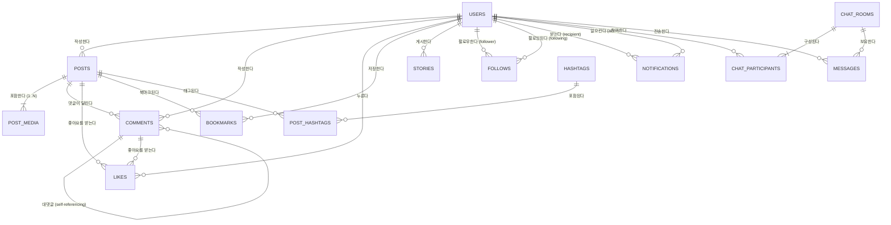

# 📸 Instagram 클론 데이터베이스 설계 명세서 (db.md)

본 문서는 SQLite를 기반으로 하는 Instagram 풀스택 클론 프로젝트의 데이터베이스 설계 및 스키마 명세서입니다.  
ORM으로는 Python의 **SQLAlchemy 2.0 (Declarative Base)**을 기준 모델로 정의하며, 마이그레이션 도구로 **Alembic**을 사용합니다.

---

## 1. 개요 및 설계 원칙

1. **RDBMS**: SQLite3 (파일 기반 경량 DB)
   - `PRAGMA foreign_keys = ON;` 필수 활성화 (외래 키 무결성 보장)
   - `PRAGMA journal_mode = WAL;` (Write-Ahead Logging 모드로 동시 읽기/쓰기 성능 최적화)
2. **네이밍 규칙**:
   - 테이블명: 복수형 스네이크 케이스 (예: `users`, `posts`, `comments`)
   - 기본 키(PK): `id` (정수형 Auto-Increment 또는 UUID 문자열)
   - 외래 키(FK): `{단수형_테이블명}_id` (예: `user_id`, `post_id`)
   - 날짜/시간: UTC 기준 `created_at`, `updated_at` (ISO 8601 포맷)
   - 논리 삭제(Soft Delete): 필요한 테이블에 `is_deleted` 컬럼 배치
3. **확장성 및 정규화**:
   - 다중 미디어(캐러셀) 지원을 위해 `posts`와 `post_media` 분리 (1:N)
   - 태그 및 좋아요/북마크/팔로우 등 다대다(N:M) 관계의 조인 테이블 정규화

---

## 2. ERD (Entity Relationship Diagram)



---

## 3. 테이블 상세 명세

### 3.1. `users` (사용자 테이블)
회원 계정 기본 정보, 인증 및 프로필 데이터를 관리합니다.

| 컬럼명 | 데이터 타입 | 제약 조건 | 설명 |
| :--- | :--- | :--- | :--- |
| `id` | INTEGER | PK, AUTOINCREMENT | 고유 식별자 |
| `username` | VARCHAR(30) | UNIQUE, NOT NULL | 사용자 고유 아이디 (소문자, 영숫자, 밑줄, 마침표) |
| `email` | VARCHAR(255) | UNIQUE, NOT NULL | 로그인/인증 이메일 |
| `hashed_password` | VARCHAR(255) | NOT NULL | bcrypt 암호화 해시 |
| `full_name` | VARCHAR(100) | NULL | 사용자 실명/표시명 |
| `bio` | TEXT | NULL | 자기소개 프로필 문구 (최대 150자) |
| `website` | VARCHAR(255) | NULL | 외부 프로필 링크 URL |
| `profile_img_url` | VARCHAR(500) | DEFAULT '/static/default_profile.png' | 프로필 아바타 이미지 경로 |
| `is_private` | BOOLEAN | DEFAULT FALSE, NOT NULL | 비공개 계정 여부 |
| `is_verified` | BOOLEAN | DEFAULT FALSE, NOT NULL | 인증 뱃지(블루마크) 여부 |
| `created_at` | DATETIME | DEFAULT CURRENT_TIMESTAMP, NOT NULL | 가입일시 |
| `updated_at` | DATETIME | DEFAULT CURRENT_TIMESTAMP, NOT NULL | 수정일시 |

- **인덱스**:
  - `idx_users_username` on `username`
  - `idx_users_email` on `email`

---

### 3.2. `posts` (게시물 테이블)
인스타그램 피드 게시물의 텍스트 캡션 및 메타데이터를 저장합니다.

| 컬럼명 | 데이터 타입 | 제약 조건 | 설명 |
| :--- | :--- | :--- | :--- |
| `id` | INTEGER | PK, AUTOINCREMENT | 고유 식별자 |
| `user_id` | INTEGER | FK -> `users.id` (ON DELETE CASCADE), NOT NULL | 작성자 ID |
| `caption` | TEXT | NULL | 게시물 본문 (최대 2,200자) |
| `location` | VARCHAR(100) | NULL | 위치 정보 텍스트 (예: 'Seoul, Korea') |
| `hide_likes` | BOOLEAN | DEFAULT FALSE, NOT NULL | 좋아요 수 숨김 여부 |
| `disable_comments` | BOOLEAN | DEFAULT FALSE, NOT NULL | 댓글 기능 비활성화 여부 |
| `created_at` | DATETIME | DEFAULT CURRENT_TIMESTAMP, NOT NULL | 작성일시 |
| `updated_at` | DATETIME | DEFAULT CURRENT_TIMESTAMP, NOT NULL | 수정일시 |

- **인덱스**:
  - `idx_posts_user_id` on `user_id`
  - `idx_posts_created_at` on `created_at DESC` (피드 정렬 최적화)

---

### 3.3. `post_media` (게시물 미디어 테이블 - 다중 이미지/영상)
하나의 게시물에 최대 10장까지 등록 가능한 사진/동영상 파일 정보를 관리합니다.

| 컬럼명 | 데이터 타입 | 제약 조건 | 설명 |
| :--- | :--- | :--- | :--- |
| `id` | INTEGER | PK, AUTOINCREMENT | 고유 식별자 |
| `post_id` | INTEGER | FK -> `posts.id` (ON DELETE CASCADE), NOT NULL | 대상 게시물 ID |
| `media_url` | VARCHAR(500) | NOT NULL | 미디어 파일 저장 경로/URL |
| `media_type` | VARCHAR(10) | DEFAULT 'IMAGE', NOT NULL | 'IMAGE' 또는 'VIDEO' |
| `order_index` | INTEGER | DEFAULT 0, NOT NULL | 캐러셀 표시 순서 (0, 1, 2...) |
| `aspect_ratio` | VARCHAR(10) | DEFAULT '1:1' | 비율 ('1:1', '4:5', '16:9' 등) |
| `created_at` | DATETIME | DEFAULT CURRENT_TIMESTAMP, NOT NULL | 생성일시 |

- **인덱스**:
  - `idx_post_media_post_id` on `post_id`

---

### 3.4. `comments` (댓글 및 대댓글 테이블)
게시물에 달리는 댓글과 1-depth 대댓글을 자체 참조(Self-Referencing) 구조로 지원합니다.

| 컬럼명 | 데이터 타입 | 제약 조건 | 설명 |
| :--- | :--- | :--- | :--- |
| `id` | INTEGER | PK, AUTOINCREMENT | 고유 식별자 |
| `post_id` | INTEGER | FK -> `posts.id` (ON DELETE CASCADE), NOT NULL | 대상 게시물 ID |
| `user_id` | INTEGER | FK -> `users.id` (ON DELETE CASCADE), NOT NULL | 댓글 작성자 ID |
| `parent_id` | INTEGER | FK -> `comments.id` (ON DELETE CASCADE), NULL | 부모 댓글 ID (NULL이면 일반 댓글, 값이면 대댓글) |
| `content` | TEXT | NOT NULL | 댓글 본문 |
| `created_at` | DATETIME | DEFAULT CURRENT_TIMESTAMP, NOT NULL | 작성일시 |
| `updated_at` | DATETIME | DEFAULT CURRENT_TIMESTAMP, NOT NULL | 수정일시 |

- **인덱스**:
  - `idx_comments_post_id` on `post_id`
  - `idx_comments_parent_id` on `parent_id`

---

### 3.5. `likes` (통합 좋아요 테이블)
게시물 또는 댓글에 대한 좋아요를 처리하는 다형성 테이블 또는 구분 테이블입니다.

| 컬럼명 | 데이터 타입 | 제약 조건 | 설명 |
| :--- | :--- | :--- | :--- |
| `id` | INTEGER | PK, AUTOINCREMENT | 고유 식별자 |
| `user_id` | INTEGER | FK -> `users.id` (ON DELETE CASCADE), NOT NULL | 좋아요 누른 유저 ID |
| `post_id` | INTEGER | FK -> `posts.id` (ON DELETE CASCADE), NULL | 대상 게시물 ID (게시물 좋아요 시) |
| `comment_id` | INTEGER | FK -> `comments.id` (ON DELETE CASCADE), NULL | 대상 댓글 ID (댓글 좋아요 시) |
| `created_at` | DATETIME | DEFAULT CURRENT_TIMESTAMP, NOT NULL | 생성일시 |

- **유니크 제약**:
  - `UNIQUE(user_id, post_id)` (게시물 중복 좋아요 방지)
  - `UNIQUE(user_id, comment_id)` (댓글 중복 좋아요 방지)
- **인덱스**:
  - `idx_likes_post_id` on `post_id`
  - `idx_likes_user_id` on `user_id`

---

### 3.6. `bookmarks` (저장됨/북마크 테이블)
사용자가 보관함에 저장한 게시물을 기록합니다.

| 컬럼명 | 데이터 타입 | 제약 조건 | 설명 |
| :--- | :--- | :--- | :--- |
| `id` | INTEGER | PK, AUTOINCREMENT | 고유 식별자 |
| `user_id` | INTEGER | FK -> `users.id` (ON DELETE CASCADE), NOT NULL | 사용자 ID |
| `post_id` | INTEGER | FK -> `posts.id` (ON DELETE CASCADE), NOT NULL | 저장된 게시물 ID |
| `created_at` | DATETIME | DEFAULT CURRENT_TIMESTAMP, NOT NULL | 보관일시 |

- **유니크 제약**: `UNIQUE(user_id, post_id)`

---

### 3.7. `follows` (팔로우 관계 테이블)
사용자 간의 소셜 그래프(팔로워/팔로잉) 관계를 구성합니다.

| 컬럼명 | 데이터 타입 | 제약 조건 | 설명 |
| :--- | :--- | :--- | :--- |
| `id` | INTEGER | PK, AUTOINCREMENT | 고유 식별자 |
| `follower_id` | INTEGER | FK -> `users.id` (ON DELETE CASCADE), NOT NULL | 팔로우를 신청/하는 유저 |
| `following_id` | INTEGER | FK -> `users.id` (ON DELETE CASCADE), NOT NULL | 팔로우 대상이 되는 유저 |
| `status` | VARCHAR(10) | DEFAULT 'ACCEPTED', NOT NULL | 비공개 계정의 경우 'PENDING', 일반 'ACCEPTED' |
| `created_at` | DATETIME | DEFAULT CURRENT_TIMESTAMP, NOT NULL | 팔로우 시점 |

- **유니크 제약**: `UNIQUE(follower_id, following_id)`
- **인덱스**:
  - `idx_follows_follower` on `follower_id`
  - `idx_follows_following` on `following_id`

---

### 3.8. `stories` (스토리 테이블 - 24시간 휘발성)
작성 후 24시간 동안만 노출되는 스토리 기능 데이터입니다.

| 컬럼명 | 데이터 타입 | 제약 조건 | 설명 |
| :--- | :--- | :--- | :--- |
| `id` | INTEGER | PK, AUTOINCREMENT | 고유 식별자 |
| `user_id` | INTEGER | FK -> `users.id` (ON DELETE CASCADE), NOT NULL | 등록자 ID |
| `media_url` | VARCHAR(500) | NOT NULL | 스토리 미디어 파일 URL |
| `media_type` | VARCHAR(10) | DEFAULT 'IMAGE', NOT NULL | 'IMAGE' 또는 'VIDEO' |
| `caption` | VARCHAR(255) | NULL | 텍스트 오버레이 내용 |
| `expires_at` | DATETIME | NOT NULL | 만료 일시 (생성 시점 + 24시간) |
| `created_at` | DATETIME | DEFAULT CURRENT_TIMESTAMP, NOT NULL | 등록일시 |

- **인덱스**:
  - `idx_stories_user_expires` on `(user_id, expires_at)`

---

### 3.9. `hashtags` & `post_hashtags` (해시태그 테이블)
검색 및 태그 모아보기를 지원하기 위한 다대다 매핑 테이블입니다.

#### `hashtags`
| 컬럼명 | 데이터 타입 | 제약 조건 | 설명 |
| :--- | :--- | :--- | :--- |
| `id` | INTEGER | PK, AUTOINCREMENT | 고유 식별자 |
| `name` | VARCHAR(100) | UNIQUE, NOT NULL | 해시태그 이름 ('#' 제외) |
| `post_count` | INTEGER | DEFAULT 1, NOT NULL | 해당 해시태그를 포함한 게시물 수 |

#### `post_hashtags`
| 컬럼명 | 데이터 타입 | 제약 조건 | 설명 |
| :--- | :--- | :--- | :--- |
| `post_id` | INTEGER | FK -> `posts.id` (ON DELETE CASCADE), NOT NULL | 게시물 ID |
| `hashtag_id` | INTEGER | FK -> `hashtags.id` (ON DELETE CASCADE), NOT NULL | 해시태그 ID |

- **유니크/복합 PK**: `PRIMARY KEY(post_id, hashtag_id)`

---

### 3.10. `notifications` (알림 테이블)
좋아요, 댓글, 팔로우, 멘션 발생 시 사용자에게 전달되는 인앱 알림을 기록합니다.

| 컬럼명 | 데이터 타입 | 제약 조건 | 설명 |
| :--- | :--- | :--- | :--- |
| `id` | INTEGER | PK, AUTOINCREMENT | 고유 식별자 |
| `recipient_id` | INTEGER | FK -> `users.id` (ON DELETE CASCADE), NOT NULL | 알림 수신자 ID |
| `actor_id` | INTEGER | FK -> `users.id` (ON DELETE CASCADE), NOT NULL | 이벤트를 일으킨 유저 ID |
| `type` | VARCHAR(20) | NOT NULL | 'LIKE_POST', 'LIKE_COMMENT', 'COMMENT', 'FOLLOW', 'MENTION' |
| `post_id` | INTEGER | FK -> `posts.id` (ON DELETE SET NULL), NULL | 관련 게시물 ID |
| `comment_id` | INTEGER | FK -> `comments.id` (ON DELETE SET NULL), NULL | 관련 댓글 ID |
| `is_read` | BOOLEAN | DEFAULT FALSE, NOT NULL | 읽음 여부 |
| `created_at` | DATETIME | DEFAULT CURRENT_TIMESTAMP, NOT NULL | 알림 발생일시 |

- **인덱스**:
  - `idx_notifications_recipient` on `(recipient_id, is_read, created_at DESC)`

---

### 3.11. `chat_rooms`, `chat_participants`, `messages` (다이렉트 메시지 DM)
1:1 및 그룹 실시간 채팅을 지원하기 위한 모델입니다.

#### `chat_rooms`
| 컬럼명 | 데이터 타입 | 제약 조건 | 설명 |
| :--- | :--- | :--- | :--- |
| `id` | INTEGER | PK, AUTOINCREMENT | 고유 식별자 |
| `is_group` | BOOLEAN | DEFAULT FALSE, NOT NULL | 그룹 채팅방 여부 |
| `room_name` | VARCHAR(100) | NULL | 방 이름 (그룹 채팅 시) |
| `updated_at` | DATETIME | DEFAULT CURRENT_TIMESTAMP, NOT NULL | 마지막 메시지 전송 시각 |
| `created_at` | DATETIME | DEFAULT CURRENT_TIMESTAMP, NOT NULL | 방 개설 시각 |

#### `chat_participants`
| 컬럼명 | 데이터 타입 | 제약 조건 | 설명 |
| :--- | :--- | :--- | :--- |
| `room_id` | INTEGER | FK -> `chat_rooms.id` (ON DELETE CASCADE), NOT NULL | 채팅방 ID |
| `user_id` | INTEGER | FK -> `users.id` (ON DELETE CASCADE), NOT NULL | 참가 유저 ID |
| `joined_at` | DATETIME | DEFAULT CURRENT_TIMESTAMP, NOT NULL | 참가 일시 |

- **복합 PK**: `PRIMARY KEY(room_id, user_id)`

#### `messages`
| 컬럼명 | 데이터 타입 | 제약 조건 | 설명 |
| :--- | :--- | :--- | :--- |
| `id` | INTEGER | PK, AUTOINCREMENT | 고유 식별자 |
| `room_id` | INTEGER | FK -> `chat_rooms.id` (ON DELETE CASCADE), NOT NULL | 소속 채팅방 ID |
| `sender_id` | INTEGER | FK -> `users.id` (ON DELETE CASCADE), NOT NULL | 발신자 ID |
| `content` | TEXT | NULL | 텍스트 내용 |
| `media_url` | VARCHAR(500) | NULL | 이미지/음성 등 첨부 미디어 |
| `is_read` | BOOLEAN | DEFAULT FALSE, NOT NULL | 읽음 여부 |
| `created_at` | DATETIME | DEFAULT CURRENT_TIMESTAMP, NOT NULL | 전송일시 |

---

## 4. SQLAlchemy 2.0 모델 스니펫 예시

```python
from datetime import datetime
from typing import List, Optional
from sqlalchemy import (
    Integer, String, Text, Boolean, DateTime, ForeignKey, UniqueConstraint, func
)
from sqlalchemy.orm import DeclarativeBase, Mapped, mapped_column, relationship

class Base(DeclarativeBase):
    pass

class User(Base):
    __tablename__ = "users"

    id: Mapped[int] = mapped_column(Integer, primary_key=True, autoincrement=True)
    username: Mapped[str] = mapped_column(String(30), unique=True, index=True, nullable=False)
    email: Mapped[str] = mapped_column(String(255), unique=True, index=True, nullable=False)
    hashed_password: Mapped[str] = mapped_column(String(255), nullable=False)
    full_name: Mapped[Optional[str]] = mapped_column(String(100), nullable=True)
    bio: Mapped[Optional[str]] = mapped_column(Text, nullable=True)
    website: Mapped[Optional[str]] = mapped_column(String(255), nullable=True)
    profile_img_url: Mapped[str] = mapped_column(String(500), default="/static/default_profile.png")
    is_private: Mapped[bool] = mapped_column(Boolean, default=False)
    is_verified: Mapped[bool] = mapped_column(Boolean, default=False)
    created_at: Mapped[datetime] = mapped_column(DateTime, server_default=func.now())
    updated_at: Mapped[datetime] = mapped_column(DateTime, server_default=func.now(), onupdate=func.now())

    # 관계 정의
    posts: Mapped[List["Post"]] = relationship("Post", back_populates="author", cascade="all, delete-orphan")
    comments: Mapped[List["Comment"]] = relationship("Comment", back_populates="author", cascade="all, delete-orphan")
    likes: Mapped[List["Like"]] = relationship("Like", back_populates="user", cascade="all, delete-orphan")
    bookmarks: Mapped[List["Bookmark"]] = relationship("Bookmark", back_populates="user", cascade="all, delete-orphan")
    stories: Mapped[List["Story"]] = relationship("Story", back_populates="author", cascade="all, delete-orphan")

class Post(Base):
    __tablename__ = "posts"

    id: Mapped[int] = mapped_column(Integer, primary_key=True, autoincrement=True)
    user_id: Mapped[int] = mapped_column(ForeignKey("users.id", ondelete="CASCADE"), nullable=False, index=True)
    caption: Mapped[Optional[str]] = mapped_column(Text, nullable=True)
    location: Mapped[Optional[str]] = mapped_column(String(100), nullable=True)
    hide_likes: Mapped[bool] = mapped_column(Boolean, default=False)
    disable_comments: Mapped[bool] = mapped_column(Boolean, default=False)
    created_at: Mapped[datetime] = mapped_column(DateTime, server_default=func.now(), index=True)
    updated_at: Mapped[datetime] = mapped_column(DateTime, server_default=func.now(), onupdate=func.now())

    author: Mapped["User"] = relationship("User", back_populates="posts")
    media: Mapped[List["PostMedia"]] = relationship("PostMedia", back_populates="post", cascade="all, delete-orphan", order_by="PostMedia.order_index")
    comments: Mapped[List["Comment"]] = relationship("Comment", back_populates="post", cascade="all, delete-orphan")
    likes: Mapped[List["Like"]] = relationship("Like", back_populates="post", cascade="all, delete-orphan")

class PostMedia(Base):
    __tablename__ = "post_media"

    id: Mapped[int] = mapped_column(Integer, primary_key=True, autoincrement=True)
    post_id: Mapped[int] = mapped_column(ForeignKey("posts.id", ondelete="CASCADE"), nullable=False, index=True)
    media_url: Mapped[str] = mapped_column(String(500), nullable=False)
    media_type: Mapped[str] = mapped_column(String(10), default="IMAGE")
    order_index: Mapped[int] = mapped_column(Integer, default=0)
    aspect_ratio: Mapped[str] = mapped_column(String(10), default="1:1")

    post: Mapped["Post"] = relationship("Post", back_populates="media")
```

---

## 5. SQLite 설정 및 최적화 가이드

### 5.1. 외래 키 활성화 이벤트 리스너
SQLite는 기본적으로 외래 키 제약 조건을 강제하지 않으므로, SQLAlchemy 세션 엔진 생성 시 아래 리스너를 반드시 등록합니다:

```python
from sqlalchemy import create_engine, event
from sqlalchemy.engine import Engine

SQLALCHEMY_DATABASE_URL = "sqlite:///./instagram.db"

engine = create_engine(
    SQLALCHEMY_DATABASE_URL,
    connect_args={"check_same_thread": False}
)

@event.listens_for(Engine, "connect")
def set_sqlite_pragma(dbapi_connection, connection_record):
    cursor = dbapi_connection.cursor()
    cursor.execute("PRAGMA foreign_keys=ON")
    cursor.execute("PRAGMA journal_mode=WAL")
    cursor.close()
```

### 5.2. 마이그레이션 (Alembic)
1. 초기화: `alembic init alembic`
2. `alembic/env.py`에 `target_metadata = Base.metadata` 연동
3. 마이그레이션 생성: `alembic revision --autogenerate -m "Initial instagram schema"`
4. 마이그레이션 적용: `alembic upgrade head`
