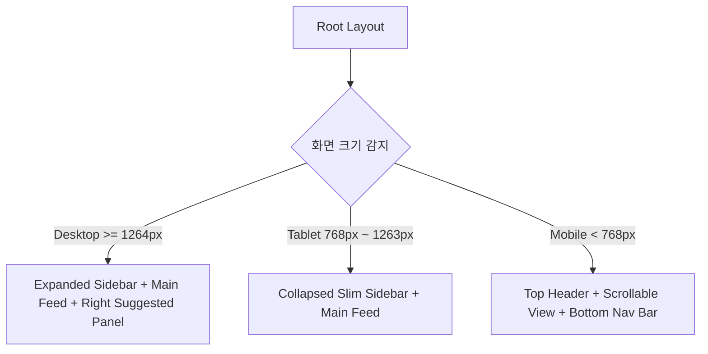

# 🎨 Instagram 클론 프론트엔드 명세서 (front.md)

본 문서는 React와 Vite를 기반으로 하는 Instagram 웹 애플리케이션의 사용자 인터페이스(UI), 사용자 경험(UX), 상태 관리, 컴포넌트 아키텍처 및 클라이언트 통신 명세서입니다.

---

## 1. 프론트엔드 기술 스택

| 분류 | 기술 / 라이브러리 | 버전 | 목적 |
| :--- | :--- | :--- | :--- |
| **Core Framework** | React + TypeScript (또는 JS) | 18.2+ | UI 렌더링 및 컴포넌트 로직 |
| **Bundler & Tooling**| Vite | 5.0+ | 초고속 HMR 및 최적화 빌드 |
| **Routing** | React Router DOM | v6.20+ | 클라이언트 사이드 라우팅 및 중첩 라우트 |
| **Styling** | Tailwind CSS + Vanilla CSS | 3.4+ | 유틸리티 스타일링 및 커스텀 애니메이션 |
| **Server State** | TanStack Query (React Query) | v5.0+ | 서버 캐싱, 무한 스크롤, 낙관적 업데이트 |
| **Client State** | Zustand | 4.5+ | 인증 상태, 글로벌 모달, 알림 토스트 관리 |
| **HTTP Client** | Axios | 1.6+ | API 요청 및 JWT 토큰 인터셉터 |
| **Icons** | Lucide React | 0.300+ | Instagram 스타일 모던 라인 아이콘 셋 |
| **Image & Date** | date-fns | 3.0+ | 상대 시간 표기 ("방금 전", "3시간 전") |

---

## 2. 디자인 시스템 및 시각적 가이드라인

Instagram 공식 디자인 철학을 철저하게 계승하며 다크 모드를 기본 지원합니다.

### 2.1. 컬러 팔레트 (Design Tokens)
- **Primary Accent**: `#0095F6` (인스타그램 시그니처 인디고 블루 - 팔로우, 게시 버튼)
- **Story Ring Gradient**: `linear-gradient(45deg, #f09433 0%, #e6683c 25%, #dc2743 50%, #cc2366 75%, #bc1888 100%)`
- **Like Heart Color**: `#ED4956` (생생한 코랄 레드)
- **Light Theme**:
  - Background: `#FFFFFF`, Surface / Card: `#FAFAFA`, Border: `#DBDBDB`, Text: `#262626`
- **Dark Theme (우선 적용)**:
  - Background: `#000000` (순수 블랙)
  - Surface / Sidebar: `#121212` (매트 다크 그레이)
  - Card / Modal: `#262626`
  - Border: `#363636`
  - Primary Text: `#F5F5F5`
  - Secondary Text: `#A8A8A8`

### 2.2. 타이포그래피
- 시스템 폰트 스택: `-apple-system, BlinkMacSystemFont, "Segoe UI", Roboto, Helvetica, Arial, sans-serif`
- 크기 계층:
  - 헤더 텍스트: 16px / Semi-bold (700)
  - 피드 본문 / 댓글: 14px / Regular (400)
  - 타임스탬프 및 메타 정보: 12px / Medium (500)

### 2.3. 마이크로 인터랙션 & 애니메이션
1. **Double Tap to Like (더블 탭 하트 팝업)**:
   - 피드 사진 영역을 연속 2회 클릭 시 중앙에 거대한 하트 아이콘이 `scale(0) -> scale(1.3) -> scale(1.0)`으로 0.4초간 나타났다가 서서히 사라짐.
2. **Like / Bookmark Bounce**:
   - 하트/리본 아이콘 클릭 시 `transform: scale(1.25)`로 순간 튕기는 스프링 모션.
3. **스토리 링(Story Ring)**:
   - 미확인 스토리가 있는 유저는 그라디언트 테두리 적용, 이미 본 스토리는 `#8E8E8E` 단색 테두리로 전환.
4. **인스타그램 로딩 스켈레톤(Skeleton UI)**:
   - 피드 로딩 시 둥근 프로필 원형 + 직사각형 이미지 영역에 은은한 펄스(`animate-pulse`) 효과 제공.

---

## 3. 반응형 레이아웃 아키텍처



### 3.1. Desktop (`>= 1264px`)
- **좌측 고정 사이드바 (폭 245px)**: 인스타그램 로고, 홈, 검색, 탐색, 릴스, 메시지(배지), 알림(배지), 만들기(+), 프로필, 더보기 메뉴.
- **중앙 피드 (폭 630px)**: 상단 스토리 트레이 + 피드 카드 스크롤.
- **우측 추천 패널 (폭 320px)**: 내 미니 프로필 + "회원님을 위한 추천" 목록 (팔로우 버튼 포함).

### 3.2. Tablet (`768px ~ 1263px`)
- **슬림 사이드바 (폭 72px)**: 텍스트 라벨 없이 아이콘만 중앙 정렬 표시.
- 우측 추천 패널 숨김 처리.

### 3.3. Mobile (`< 768px`)
- **상단 헤더 (높이 44px)**: 인스타그램 로고 + 우측 알림(하트), DM(비행기) 아이콘.
- **하단 네비게이션 바 (높이 48px 고정)**: 홈, 탐색, 새 게시물(+), 릴스, 프로필 아바타.

---

## 4. 라우팅 및 페이지 구조 (Routes)

```
/
├── /login                    # 로그인 페이지 (인스타그램 폰 목업 애니메이션)
├── /signup                   # 회원가입 페이지
├── /                         # 메인 홈 피드 (보호된 라우트)
├── /explore                  # 탐색 페이지 (그리드 피드)
├── /direct/inbox             # DM 대화방 메인 목록
├── /direct/t/:roomId         # 특정 대화방 채팅 화면
├── /:username                # 유저 프로필 페이지
│   ├── /:username/saved      # (본인 전용) 저장된 게시물 탭
│   └── /:username/tagged     # 태그된 게시물 탭
├── /p/:postId                # 게시물 단독 상세 페이지 (URL 직접 접근 시)
└── /stories/:username/:id    # 전체 화면 스토리 뷰어
```

---

## 5. 핵심 페이지 및 기능 명세

### 5.1. 홈 화면 (Home Feed)
- **스토리 트레이 (`StoryTray.tsx`)**:
  - 수평 가로 스크롤 가능 컨테이너 (스크롤바 숨김).
  - 맨 앞에는 "내 스토리 추가 (+)" 버튼.
  - 뒤이어 팔로우한 사람들의 프로필 원형 아바타 + 그라디언트 링.
  - 클릭 시 모달 형태의 풀스크린 스토리 뷰어 오픈.
- **포스트 카드 (`PostCard.tsx`)**:
  - 헤더: 작성자 아바타, 아이디, 등록 시간 ("3시간 전"), 옵션 더보기(...) 버튼.
  - 미디어 뷰어:
    - 단일 이미지 또는 다중 이미지 캐러셀 슬라이더 (좌우 화살표 및 하단 도트 인디케이터).
    - 더블 클릭 감지 (더블 탭 좋아요 인터랙션).
  - 액션 바: 좋아요(하트), 댓글(말풍선), 공유/전송(종이비행기), 북마크(리본).
  - 좋아요 수 카운트: "좋아요 1,234개".
  - 캡션 영역: 작성자 아이디 + 본문 내용 ("... 더 보기" 접기/펼치기 지원).
  - 댓글 프리뷰: 최신 댓글 2개 노출 + "댓글 18개 모두 보기" 클릭 시 상세 모달 트리거.
  - 즉석 댓글 입력창: 이모지 피커 버튼 + 인풋창 + '게시' 버튼.
- **무한 스크롤 (`useInfiniteQuery`)**:
  - 하단 진입 시 `IntersectionObserver`로 다음 피드 자동 패치.

### 5.2. 게시물 작성 모달 (`CreatePostModal.tsx`)
단계별 스텝(Stepper)으로 작동:
1. **Step 1: 미디어 선택**: 드래그 앤 드롭 또는 파일 탐색기로 복수 이미지 첨부 (최대 10장).
2. **Step 2: 미리보기 & 편집**: 이미지 비율 설정(1:1, 4:5, 16:9), 순서 재배치, 삭제.
3. **Step 3: 본문 입력 & 공유**:
   - 우측 패널에 내 프로필, 텍스트 입력 에어리어 (2,200자 카운터).
   - 위치 추가 인풋, 고급 설정(좋아요 수 숨김 토글, 댓글 닫기 토글).
   - "공유하기" 버튼 클릭 시 FormData 전송 및 피드 캐시 자동 무효화(`queryClient.invalidateQueries`).

### 5.3. 게시물 상세 모달 (`PostDetailModal.tsx`)
- 피드나 프로필 그리드 클릭 시 URL은 `/p/:id`로 변경되지만 배경 페이지 위에 오버레이 모달로 렌더링.
- **좌측**: 미디어 캐러셀 (1:1 또는 원본 비율 반응형 표시).
- **우측**:
  - 상단: 작성자 프로필 + 팔로우 버튼 + 더보기 메뉴.
  - 중간: 작성자 캡션 및 댓글 리스트 (대댓글 들여쓰기 뷰, 각 댓글별 좋아요 버튼).
  - 하단: 액션 바 + 좋아요 수 + 등록일자 + 댓글 작성창 고정.

### 5.4. 프로필 페이지 (`ProfilePage.tsx`)
- **프로필 상단 헤더**:
  - 아바타 이미지 (클릭 시 스토리 있거나 본인이면 사진 변경 트리거).
  - 유저네임, 본인인 경우 "프로필 편집", 타인인 경우 "팔로우 / 메시지 보내기" 버튼.
  - 통계 정보: 게시물 `N`개, 팔로워 `N`명, 팔로잉 `N`명 (클릭 시 팔로워/팔로잉 모달 팝업).
  - 풀네임, 바이오 줄바꿈 지원, 웹사이트 링크.
- **탭 네비게이션**: `게시물` | `저장됨` (본인만) | `태그됨`.
- **게시물 그리드 (`PostGrid.tsx`)**:
  - 3열 정사각형(`aspect-square`) 그리드 레이아웃.
  - 마우스 호버 시 반투명 블랙 오버레이와 함께 좋아요 수(♥) 및 댓글 수(💬) 노출.
  - 다중 이미지 게시물인 경우 우측 상단에 겹친 사진 아이콘 인디케이터 표시.

### 5.5. 다이렉트 메시지 (Direct Message - `/direct`)
- **좌측 목록**: 참여 중인 대화방 목록 (상대방 아바타, 이름, 마지막 메시지 미리보기 및 경과 시간).
- **우측 채팅창**:
  - 헤더: 대화 상대 프로필 및 상태.
  - 메시지 영역: 말풍선 뷰 (내 메시지는 우측 파란색/보라색, 상대방 메시지는 좌측 다크그레이).
  - 실시간 송수신: `WebSocket` 연결을 통한 즉각적인 메시지 수신 및 스크롤 최하단 자동 이동.
  - 하단: 메시지 입력창, 이미지 첨부 버튼, 하트 전송 버튼.

### 5.6. 전체 화면 스토리 뷰어 (`StoryViewerModal.tsx`)
- 전체 화면 검은색 배경에 중앙 모바일 비율(9:16) 스토리 컨테이너.
- 상단 진행 바: 각 스토리당 5초 프로그레스 애니메이션 (여러 개일 경우 단계별 채워짐).
- 좌/우 화면 클릭 시 이전/다음 스토리로 즉각 이동.
- 하단 답장 전송 인풋 (입력 시 상대방 DM으로 전송).

---

## 6. 전역 상태 관리 (Zustand Stores)

### 6.1. `useAuthStore`
```typescript
interface AuthState {
  user: User | null;
  token: string | null;
  isAuthenticated: boolean;
  setAuth: (user: User, token: string) => void;
  logout: () => void;
  updateUser: (updatedUser: Partial<User>) => void;
}
```

### 6.2. `useModalStore`
게시물 작성, 게시물 상세, 팔로워 목록, 설정 모달 등의 열림 상태를 중앙에서 관리하여 불필요한 prop drilling 방지:
```typescript
interface ModalState {
  isCreatePostOpen: boolean;
  selectedPostId: number | null;
  activeFollowModal: { type: 'followers' | 'following'; username: string } | null;
  openCreatePost: () => void;
  closeCreatePost: () => void;
  openPostDetail: (postId: number) => void;
  closePostDetail: () => void;
}
```

---

## 7. API 클라이언트 및 TanStack Query 전략

### 7.1. Axios Interceptor
- 요청 시 `localStorage`에 저장된 `access_token`을 `Authorization: Bearer <token>` 헤더에 자동 추가.
- `401 Unauthorized` 에러 발생 시 자동 로그아웃 처리 및 `/login` 리다이렉트.

### 7.2. 낙관적 업데이트 (Optimistic Updates - 좋아요 기능 예시)
네트워크 응답을 기다리지 않고 사용자가 하트를 누르는 순간 UI의 하트 상태와 카운트를 즉시 반전시켜 네이티브 앱 수준의 즉각적인 사용자 반응성을 제공합니다.
```typescript
const useToggleLike = (postId: number) => {
  const queryClient = useQueryClient();

  return useMutation({
    mutationFn: () => api.post(`/posts/${postId}/like`),
    onMutate: async () => {
      await queryClient.cancelQueries({ queryKey: ['posts'] });
      const previousFeed = queryClient.getQueryData(['posts']);
      // 캐시 데이터에서 해당 postId의 is_liked와 like_count를 즉시 변경
      queryClient.setQueryData(['posts'], (old: any) => updateLikeInCache(old, postId));
      return { previousFeed };
    },
    onError: (err, variables, context) => {
      // 실패 시 이전 상태로 롤백
      if (context?.previousFeed) {
        queryClient.setQueryData(['posts'], context.previousFeed);
      }
    },
  });
};
```
