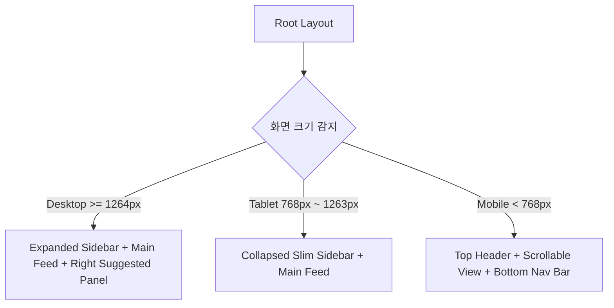

# 🎨 Muksta 프론트엔드 명세서 (front.md)

본 문서는 React와 Vite를 기반으로 하는 Muksta 웹 애플리케이션의 사용자 인터페이스(UI), 사용자 경험(UX), 상태 관리, 컴포넌트 아키텍처 명세서입니다.

> **현재 연동 상태 (2026-10-07 기준)**: 프론트엔드는 `backend.md`에서 설명하는 FastAPI 서버와 **아직 연동되어 있지 않다.** 모든 화면은 `src/mock/initialData.ts`의 정적 목(mock) 데이터를 `Zustand` 스토어에 그대로 올려 동작하며, 좋아요·댓글·북마크·새 게시물 등 모든 상호작용은 브라우저 메모리에서만 상태를 바꾼다. 새로고침하면 초기 목 데이터로 되돌아간다. 로그인(`LoginPage`)도 실제 인증 요청 없이 `mock/initialData.ts`의 `TEST_CREDENTIALS`와 입력값을 비교해 통과시키고, 토큰 자리에는 고정 문자열 `'mock-jwt-token-xyz'`를 넣는다. `axios`가 `package.json` 의존성에는 있지만 코드에서 실제로 `import`해 쓰는 곳은 없다. 백엔드 API와 실제로 통신하도록 교체하는 작업(Axios 인스턴스, API 훅, 로그인/피드/업로드 연동 등)은 아직 하지 않았다.

---

## 1. 프론트엔드 기술 스택

| 분류 | 기술 / 라이브러리 | 실제 버전(`package.json`) | 목적 |
| :--- | :--- | :--- | :--- |
| **Core Framework** | React + TypeScript | 19.2 / TS 6.0 | UI 렌더링 및 컴포넌트 로직 |
| **Bundler & Tooling**| Vite | 8.3 | HMR 및 프로덕션 빌드 (Node 20+ 필요) |
| **Routing** | React Router DOM | 7.18 | 클라이언트 사이드 라우팅 |
| **Styling** | Tailwind CSS 4 (`@tailwindcss/postcss`) + Vanilla CSS | 4.3 | 유틸리티 스타일링 및 커스텀 애니메이션 |
| **Client State** | Zustand (+ `persist` 미들웨어) | 5.0 | 인증·모달·게시물·설정 상태를 전부 로컬에서 관리 |
| **Icons** | Lucide React | 1.50 | Muksta UI에 맞춘 모던 라인 아이콘 셋 |
| **Date** | date-fns | 4.4 | 상대 시간 표기 ("방금 전", "3시간 전") |
| **기타** | clsx | 2.1 | 조건부 클래스네임 조합 |
| **설치되어 있으나 미사용** | axios | 1.20 | 의존성에만 존재, 실제 API 호출 코드 없음 |
| **Lint** | oxlint | 1.81 | `npm run lint` |

TanStack Query, WebSocket 클라이언트는 설치되어 있지 않다. 서버 캐싱이나 실시간 통신은 구현되지 않았다.

---

## 2. 디자인 시스템 및 시각적 가이드라인

Muksta만의 디자인 원칙을 따르며 다크 모드를 기본 지원합니다.

### 2.1. 컬러 팔레트 (Design Tokens)
- **Primary Accent**: `#0095F6` (인스타그램 시그니처 인디고 블루 - 팔로우, 게시 버튼)
- **Story Ring Gradient**: `linear-gradient(45deg, #f09433 0%, #e6683c 25%, #dc2743 50%, #cc2366 75%, #bc1888 100%)`
- **Like Heart Color**: `#ED4956` (생생한 코랄 레드)
- **Light Theme**:
  - Background: `#FFFFFF`, Surface / Card: `#FAFAFA`, Border: `#DBDBDB`, Text: `#262626`
- **Dark Theme (우선 적용)**:
  - Background: `#000000` (순수 블랙)
  - Surface / Sidebar: `#121212` (매트 다크 그레이)
  - Card / Modal: `#262626`
  - Border: `#363636`
  - Primary Text: `#F5F5F5`
  - Secondary Text: `#A8A8A8`

### 2.2. 타이포그래피
- 시스템 폰트 스택: `-apple-system, BlinkMacSystemFont, "Segoe UI", Roboto, Helvetica, Arial, sans-serif`
- 크기 계층:
  - 헤더 텍스트: 16px / Semi-bold (700)
  - 피드 본문 / 댓글: 14px / Regular (400)
  - 타임스탬프 및 메타 정보: 12px / Medium (500)

### 2.3. 마이크로 인터랙션 & 애니메이션
1. **Double Tap to Like (더블 탭 하트 팝업)**:
   - 피드 사진 영역을 연속 2회 클릭 시 중앙에 거대한 하트 아이콘이 `scale(0) -> scale(1.3) -> scale(1.0)`으로 0.4초간 나타났다가 서서히 사라짐.
2. **Like / Bookmark Bounce**:
   - 하트/리본 아이콘 클릭 시 `transform: scale(1.25)`로 순간 튕기는 스프링 모션.
3. **스토리 링(Story Ring)**:
   - 미확인 스토리가 있는 유저는 그라디언트 테두리 적용, 이미 본 스토리는 `#8E8E8E` 단색 테두리로 전환.
4. **인스타그램 로딩 스켈레톤(Skeleton UI)**:
   - 피드 로딩 시 둥근 프로필 원형 + 직사각형 이미지 영역에 은은한 펄스(`animate-pulse`) 효과 제공.

---

## 3. 반응형 레이아웃 아키텍처



### 3.1. Desktop (`>= 1264px`)
- **좌측 고정 사이드바 (폭 245px)**: 인스타그램 로고, 홈, 검색, 탐색, 릴스, 메시지(배지), 알림(배지), 만들기(+), 프로필, 더보기 메뉴.
- **중앙 피드 (폭 630px)**: 상단 스토리 트레이 + 피드 카드 스크롤.
- **우측 추천 패널 (폭 320px)**: 내 미니 프로필 + "회원님을 위한 추천" 목록 (팔로우 버튼 포함).

### 3.2. Tablet (`768px ~ 1263px`)
- **슬림 사이드바 (폭 72px)**: 텍스트 라벨 없이 아이콘만 중앙 정렬 표시.
- 우측 추천 패널 숨김 처리.

### 3.3. Mobile (`< 768px`)
- **상단 헤더 (높이 44px)**: 인스타그램 로고 + 우측 알림(하트), DM(비행기) 아이콘.
- **하단 네비게이션 바 (높이 48px 고정)**: 홈, 탐색, 새 게시물(+), 릴스, 프로필 아바타.

---

## 4. 라우팅 및 페이지 구조 (Routes)

실제 `App.tsx`에 등록된 라우트는 다음과 같다. 스토리 뷰어·게시물 상세·저장됨/태그됨 탭은 별도 경로가 아니라 `useModalStore`의 상태 또는 페이지 내부 탭 전환으로 처리한다.

```
/
├── /login                           # 로그인 페이지 (비인증 시에만)
├── /signup                          # 회원가입 페이지
├── /                                # 메인 홈 피드 (인증 필요)
├── /explore                         # 탐색 페이지 (그리드 피드)
├── /direct                          # 다이렉트 메시지 (목록 + 대화창 한 화면)
├── /p/:postId                       # 게시물 상세 — HomePage를 그대로 렌더링하고 모달로 오버레이
├── /:username                       # 유저 프로필 페이지 (게시물/저장됨/태그됨은 페이지 내부 탭)
└── /settings                        # 설정 루트
    ├── /settings/password           # 비밀번호 변경
    ├── /settings/contact            # 연락처 정보
    ├── /settings/account-privacy    # 계정 공개 범위
    ├── /settings/switch             # 계정 전환 (UI만, API 없음)
    ├── /settings/deactivate         # 계정 비활성화
    ├── /settings/archive            # 보관함
    ├── /settings/download           # 내 정보 다운로드
    ├── /settings/hide-likes         # 좋아요 수 숨김 기본값
    ├── /settings/language           # 언어
    ├── /settings/theme              # 테마(다크/라이트)
    ├── /settings/accessibility      # 모션 줄이기 등
    ├── /settings/help               # 고객센터
    ├── /settings/privacy-policy     # 개인정보처리방침
    └── /settings/terms              # 약관
```

스토리 뷰어는 라우트 전환 없이 `useModalStore.activeStoryGroup`을 채워 풀스크린 모달로 띄운다.

---

## 5. 핵심 페이지 및 기능 명세

### 5.1. 홈 화면 (Home Feed)
- **스토리 트레이 (`StoryTray.tsx`)**:
  - 수평 가로 스크롤 가능 컨테이너 (스크롤바 숨김).
  - 맨 앞에는 "내 스토리 추가 (+)" 버튼.
  - 뒤이어 팔로우한 사람들의 프로필 원형 아바타 + 그라디언트 링.
  - 클릭 시 모달 형태의 풀스크린 스토리 뷰어 오픈.
- **포스트 카드 (`PostCard.tsx`)**:
  - 헤더: 작성자 아바타, 아이디, 등록 시간 ("3시간 전"), 옵션 더보기(...) 버튼.
  - 미디어 뷰어:
    - 단일 이미지 또는 다중 이미지 캐러셀 슬라이더 (좌우 화살표 및 하단 도트 인디케이터).
    - 더블 클릭 감지 (더블 탭 좋아요 인터랙션).
  - 액션 바: 좋아요(하트), 댓글(말풍선), 공유/전송(종이비행기), 북마크(리본).
  - 좋아요 수 카운트: "좋아요 1,234개".
  - 캡션 영역: 작성자 아이디 + 본문 내용 ("... 더 보기" 접기/펼치기 지원).
  - 댓글 프리뷰: 최신 댓글 2개 노출 + "댓글 18개 모두 보기" 클릭 시 상세 모달 트리거.
  - 즉석 댓글 입력창: 이모지 피커 버튼 + 인풋창 + '게시' 버튼.
- **무한 스크롤 (`useInfiniteQuery`)**:
  - 하단 진입 시 `IntersectionObserver`로 다음 피드 자동 패치.

### 5.2. 게시물 작성 모달 (`CreatePostModal.tsx`)
단계별 스텝(Stepper)으로 작동:
1. **Step 1: 미디어 선택**: 드래그 앤 드롭 또는 파일 탐색기로 복수 이미지 첨부 (최대 10장).
2. **Step 2: 미리보기 & 편집**: 이미지 비율 설정(1:1, 4:5, 16:9), 순서 재배치, 삭제.
3. **Step 3: 본문 입력 & 공유**:
   - 우측 패널에 내 프로필, 텍스트 입력 에어리어 (2,200자 카운터).
   - 위치 추가 인풋, 고급 설정(좋아요 수 숨김 토글, 댓글 닫기 토글).
   - "공유하기" 버튼 클릭 시 FormData 전송 및 피드 캐시 자동 무효화(`queryClient.invalidateQueries`).

### 5.3. 게시물 상세 모달 (`PostDetailModal.tsx`)
- 피드나 프로필 그리드 클릭 시 URL은 `/p/:id`로 변경되지만 배경 페이지 위에 오버레이 모달로 렌더링.
- **좌측**: 미디어 캐러셀 (1:1 또는 원본 비율 반응형 표시).
- **우측**:
  - 상단: 작성자 프로필 + 팔로우 버튼 + 더보기 메뉴.
  - 중간: 작성자 캡션 및 댓글 리스트 (대댓글 들여쓰기 뷰, 각 댓글별 좋아요 버튼).
  - 하단: 액션 바 + 좋아요 수 + 등록일자 + 댓글 작성창 고정.

### 5.4. 프로필 페이지 (`ProfilePage.tsx`)
- **프로필 상단 헤더**:
  - 아바타 이미지 (클릭 시 스토리 있거나 본인이면 사진 변경 트리거).
  - 유저네임, 본인인 경우 "프로필 편집", 타인인 경우 "팔로우 / 메시지 보내기" 버튼.
  - 통계 정보: 게시물 `N`개, 팔로워 `N`명, 팔로잉 `N`명 (클릭 시 팔로워/팔로잉 모달 팝업).
  - 풀네임, 바이오 줄바꿈 지원, 웹사이트 링크.
- **탭 네비게이션**: `게시물` | `저장됨` (본인만) | `태그됨`.
- **게시물 그리드 (`PostGrid.tsx`)**:
  - 3열 정사각형(`aspect-square`) 그리드 레이아웃.
  - 마우스 호버 시 반투명 블랙 오버레이와 함께 좋아요 수(♥) 및 댓글 수(💬) 노출.
  - 다중 이미지 게시물인 경우 우측 상단에 겹친 사진 아이콘 인디케이터 표시.

### 5.5. 다이렉트 메시지 (Direct Message - `/direct`)
- **좌측 목록**: 참여 중인 대화방 목록 (상대방 아바타, 이름, 마지막 메시지 미리보기 및 경과 시간).
- **우측 채팅창**:
  - 헤더: 대화 상대 프로필 및 상태.
  - 메시지 영역: 말풍선 뷰 (내 메시지는 우측 파란색/보라색, 상대방 메시지는 좌측 다크그레이).
  - 실시간 송수신: `WebSocket` 연결을 통한 즉각적인 메시지 수신 및 스크롤 최하단 자동 이동.
  - 하단: 메시지 입력창, 이미지 첨부 버튼, 하트 전송 버튼.

### 5.6. 전체 화면 스토리 뷰어 (`StoryViewerModal.tsx`)
- 전체 화면 검은색 배경에 중앙 모바일 비율(9:16) 스토리 컨테이너.
- 상단 진행 바: 각 스토리당 5초 프로그레스 애니메이션 (여러 개일 경우 단계별 채워짐).
- 좌/우 화면 클릭 시 이전/다음 스토리로 즉각 이동.
- 하단 답장 전송 인풋 (입력 시 상대방 DM으로 전송).

---

## 6. 전역 상태 관리 (Zustand Stores)

네 개의 독립 스토어가 있다. `useAuthStore`와 `useSettingsStore`는 `persist` 미들웨어로 `localStorage`에 저장되고, `useModalStore`와 `usePostStore`는 저장하지 않는다 (새로고침 시 `usePostStore`는 `mock/initialData.ts`로 초기화된다).

### 6.1. `useAuthStore` (`store/useAuthStore.ts`, localStorage 키 `ig-auth`)
```typescript
interface AuthState {
  user: User | null;
  token: string | null;
  isAuthenticated: boolean;
  setAuth: (user: User, token: string) => void;
  logout: () => void;
  updateUser: (updatedUser: Partial<User>) => void;
}
```
`setAuth`는 토큰을 `localStorage`의 `access_token` 키에도 별도로 저장한다. 실제로는 서버 토큰이 아니라 `LoginPage`가 넘기는 고정 문자열이 들어간다.

### 6.2. `useModalStore` (`store/useModalStore.ts`)
```typescript
interface ModalState {
  isCreatePostOpen: boolean;
  selectedPostId: number | null;
  activeStoryGroup: StoryGroup | null;
  isSearchOpen: boolean;
  isNotificationsOpen: boolean;
  openCreatePost: () => void;
  closeCreatePost: () => void;
  openPostDetail: (postId: number) => void;
  closePostDetail: () => void;
  openStoryViewer: (group: StoryGroup) => void;
  closeStoryViewer: () => void;
  toggleSearch: () => void;
  closeSearch: () => void;
  toggleNotifications: () => void;
  closeNotifications: () => void;
  closeAllDrawers: () => void;
}
```

### 6.3. `usePostStore` (`store/usePostStore.ts`)
피드, 스토리, 알림, 채팅방을 모두 담는 가장 큰 스토어. 초기값은 `mock/initialData.ts`의 `initialPosts`, `initialStories`, `initialNotifications`, `initialChatRooms`다. `toggleLike`, `toggleBookmark`, `addComment`, `toggleCommentLike`, `createPost`, `markStoryAsSeen`, `markAllNotificationsAsRead`, `markNotificationAsRead`, `setActiveChatRoom`, `sendMessage`가 전부 네트워크 요청 없이 로컬 배열을 직접 변형한다. 예를 들어 `createPost`는 첨부된 이미지를 서버에 업로드하지 않고 브라우저가 만든 로컬 URL/배열을 그대로 `posts` 앞에 추가한다.

### 6.4. `useSettingsStore` (`store/useSettingsStore.ts`, localStorage 키 `ig-settings`)
언어, 테마(다크/라이트, `<html>`에 `theme-light` 클래스 토글), 모션 줄이기, 공개 범위, 태그/멘션 허용 범위, 알림(푸시/이메일) 토글, 차단·제한 사용자 목록, 내 정보 다운로드 요청 시각 등 설정 화면 전체 상태를 보관한다. 전부 클라이언트 전역 상태일 뿐 서버에 반영되지 않는다.

---

## 7. 데이터 흐름 (현재: Mock 기반, 백엔드 미연동)

현재 구조에는 Axios 인터셉터나 TanStack Query 캐시 전략이 없다. 모든 "낙관적 업데이트처럼 보이는" 즉각 반응은 사실 네트워크 요청 자체가 없기 때문에 즉시 반영되는 것이다.

### 7.1. 좋아요 토글 (`usePostStore.toggleLike`) 예시
```typescript
toggleLike: (postId) => {
  set((state) => ({
    posts: state.posts.map((post) =>
      post.id === postId
        ? {
            ...post,
            is_liked: !post.is_liked,
            like_count: post.is_liked ? post.like_count - 1 : post.like_count + 1,
          }
        : post
    ),
  }));
},
```

### 7.2. 백엔드 연동 시 해야 할 일 (아직 미착수)
`backend.md`의 API(`/api/v1/...`)를 실제로 호출하려면 최소한 다음이 필요하다:
1. `axios` 인스턴스 생성 + `Authorization: Bearer <token>` 인터셉터, `401` 시 `useAuthStore.logout()` + `/login` 리다이렉트.
2. `LoginPage`/`SignupPage`를 `POST /auth/login`, `POST /auth/signup` 실제 호출로 교체.
3. `usePostStore`의 각 액션을 해당 REST 엔드포인트 호출 + 응답 반영으로 교체 (현재는 전부 로컬 변형).
4. 서버 캐싱/리페칭이 필요하면 TanStack Query 등 서버 상태 라이브러리 추가 설치.
5. `.env`의 `VITE_API_BASE_URL`, `VITE_STATIC_BASE_URL`은 이미 프로덕션 도메인(`https://tripastay.com`)으로 설정되어 있으므로, 연동 코드만 추가하면 됨.
