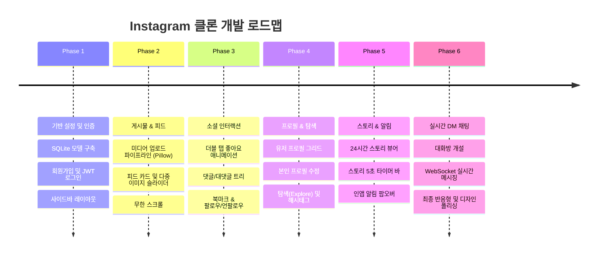

# 📘 Instagram 클론 전체 프로젝트 가이드 (guide.md)

본 문서는 **React (Frontend)** + **FastAPI (Backend)** + **SQLite (Database)** 기술 스택을 활용한 완전한 기능의 Instagram 웹 애플리케이션 개발, 실행, 시딩 및 단계별 로드맵을 제공하는 마스터 가이드입니다.

---

## 1. 시스템 전체 아키텍처

```mermaid
graph LR
    subgraph Client["Frontend (React + Vite)"]
        UI[Instagram UI / Components]
        Store[Zustand Store (Auth/Modal)]
        TQuery[TanStack Query (Cache/Sync)]
        WSClient[WebSocket Client (DM)]
    end

    subgraph Server["Backend (FastAPI)"]
        Router[API Routers /api/v1]
        Auth[JWT & Bcrypt Security]
        MediaPipeline[Pillow Image Pipeline]
        WSHub[WebSocket Connection Hub]
        ORM[SQLAlchemy 2.0 ORM]
    end

    subgraph Storage["Persistence & Files"]
        DB[(SQLite3 DB WAL Mode)]
        Disk[Local Static & Uploads]
    end

    UI --> Store
    UI --> TQuery
    TQuery -->|REST API Requests| Router
    WSClient <-->|Realtime Chat WS| WSHub
    Router --> Auth
    Router --> MediaPipeline
    MediaPipeline --> Disk
    Router --> ORM
    ORM --> DB
    WSHub --> ORM
```

---

## 2. 전체 프로젝트 디렉토리 구조

프로젝트 루트는 `backend`와 `frontend`가 독립적이면서 조화롭게 공존하는 모노레포(Monorepo) 스타일로 구성합니다:

```
my_instagram/
├── backend/                        # FastAPI 백엔드
│   ├── app/
│   │   ├── api/v1/endpoints/       # 라우터 엔드포인트
│   │   ├── core/                   # 환경변수, 보안, DB 엔진
│   │   ├── crud/                   # DB 쿼리 리포지토리
│   │   ├── models/                 # SQLAlchemy 모델 정의
│   │   ├── schemas/                # Pydantic DTO
│   │   ├── services/               # 이미지 최적화 및 비즈니스 로직
│   │   └── main.py                 # 앱 엔트리포인트
│   ├── uploads/                    # 업로드된 이미지 저장 디렉토리
│   ├── static/                     # 기본 아바타, 로고 등
│   ├── seed.py                     # 초기 더미 데이터 시딩 스크립트
│   ├── requirements.txt            # 파이썬 의존성 패키지 목록
│   └── .env.example
├── frontend/                       # React 프론트엔드
│   ├── src/
│   │   ├── api/                    # Axios 인스턴스 및 API 함수
│   │   ├── assets/                 # 로고, 정적 이미지
│   │   ├── components/
│   │   │   ├── common/             # 아바타, 버튼, 모달 래퍼
│   │   │   ├── feed/               # 포스트 카드, 스토리 트레이
│   │   │   ├── post/               # 작성 모달, 상세 모달
│   │   │   └── layout/             # 사이드바, 바텀 네비게이션
│   │   ├── hooks/                  # TanStack Query 커스텀 훅
│   │   ├── pages/                  # 홈, 로그인, 프로필, 탐색, DM
│   │   ├── store/                  # Zustand 스토어
│   │   ├── types/                  # TypeScript 인터페이스
│   │   ├── App.tsx
│   │   └── main.tsx
│   ├── package.json
│   ├── tailwind.config.js
│   ├── vite.config.ts
│   └── .env.example
├── db.md                           # 데이터베이스 설계 명세서
├── backend.md                      # 백엔드 API 명세서
├── front.md                        # 프론트엔드 UI/UX 명세서
├── guide.md                        # 전체 프로젝트 종합 가이드
└── README.md
```

---

## 3. 사전 요구사항 및 환경 준비

### 3.1. 필수 설치 항목
- **Python**: 3.10 이상 (3.11 권장)
- **Node.js**: 18.0.0 이상 (LTS 권장)
- **npm** (또는 pnpm / yarn)
- **Git**

---

## 4. 환경 셋업 및 실행 방법

### 4.1. 백엔드 (Backend) 설정 및 기동

1. **백엔드 폴더 이동 및 가상환경 생성**:
   ```bash
   cd backend
   python -m venv venv
   ```

2. **가상환경 활성화**:
   - Windows (PowerShell):
     ```powershell
     .\venv\Scripts\Activate.ps1
     ```
   - macOS / Linux:
     ```bash
     source venv/bin/activate
     ```

3. **필수 패키지 설치**:
   ```bash
   pip install -r requirements.txt
   ```

   > **주요 requirements.txt 내용**:
   > ```text
   > fastapi>=0.110.0
   > uvicorn[standard]>=0.28.0
   > sqlalchemy>=2.0.28
   > pydantic>=2.6.4
   > pydantic-settings>=2.2.1
   > python-jose[cryptography]>=3.3.0
   > passlib[bcrypt]>=1.7.4
   > python-multipart>=0.0.9
   > Pillow>=10.2.0
   > websockets>=12.0
   > alembic>=1.13.1
   > ```

4. **환경 변수 파일 생성 (`backend/.env`)**:
   ```env
   PROJECT_NAME="Instagram Clone"
   SECRET_KEY="generate-a-secure-random-secret-key-here"
   ALGORITHM="HS256"
   ACCESS_TOKEN_EXPIRE_MINUTES=120
   DATABASE_URL="sqlite:///./instagram.db"
   ALLOWED_ORIGINS="http://localhost:5173,http://127.0.0.1:5173"
   ```

5. **마이그레이션 적용 및 시딩 실행**:
   ```bash
   python seed.py
   ```
   *(이 스크립트는 Alembic으로 테이블·트리거를 만든 뒤 테스트용 계정, 게시물, 댓글 데이터를 채웁니다. 서버를 켤 때도 아직 적용되지 않은 마이그레이션이 실행됩니다.)*

6. **FastAPI 서버 구동**:
   ```bash
   uvicorn app.main:app --reload --port 8000
   ```
   - Swagger API 문서: `http://localhost:8000/docs`
   - Redoc 문서: `http://localhost:8000/redoc`

---

### 4.2. 프론트엔드 (Frontend) 설정 및 기동

1. **새 터미널 열고 프론트엔드 폴더 이동**:
   ```bash
   cd frontend
   ```

2. **의존성 설치**:
   ```bash
   npm install
   ```

   > **주요 package.json 의존성**:
   > ```json
   > "dependencies": {
   >   "react": "^18.2.0",
   >   "react-dom": "^18.2.0",
   >   "react-router-dom": "^6.22.0",
   >   "@tanstack/react-query": "^5.25.0",
   >   "zustand": "^4.5.2",
   >   "axios": "^1.6.7",
   >   "lucide-react": "^0.354.0",
   >   "date-fns": "^3.3.1"
   > }
   > ```

3. **환경 변수 파일 생성 (`frontend/.env`)**:
   ```env
   VITE_API_BASE_URL="http://localhost:8000/api/v1"
   VITE_STATIC_BASE_URL="http://localhost:8000"
   VITE_WS_BASE_URL="ws://localhost:8000/ws"
   ```

4. **Vite 개발 서버 구동**:
   ```bash
   npm run dev
   ```
   - 브라우저 접속: `http://localhost:5173`

---

## 5. 더미 데이터 시딩 스크립트 가이드 (`seed.py`)

초기 개발 및 테스트가 편리하도록 기본 샘플 계정과 피드가 즉시 제공됩니다.

### 기본 테스트 계정:
- **계정 1**: `admin` / `password123!` (풀네임: Instagram 관리자)
- **계정 2**: `traveler_june` / `password123!` (풀네임: 여행가 준)
- **계정 3**: `design_sarah` / `password123!` (풀네임: 디자이너 사라)

`seed.py` 실행 시:
1. `users` 3명 이상 등록
2. 각 유저 간의 팔로우 관계 자동 생성
3. 2~3장의 다중 미디어를 포함한 샘플 게시물 6개 이상 자동 등록
4. 댓글 및 대댓글, 좋아요 데이터 자동 등록
5. 24시간 이내의 샘플 스토리 2건 등록

---

## 6. 단계별 개발 로드맵 (Development Roadmap)

프로젝트를 한 번에 모두 만들기보다 아래 6단계 페이즈(Phase)에 맞춰 개발하면 체계적이고 안정적인 완성에 도달할 수 있습니다.



### [Phase 1] 기반 설정 및 회원 인증 시스템
- [ ] 백엔드: FastAPI 프로젝트 초기화, SQLite 엔진 및 SQLAlchemy `users` 모델 생성.
- [ ] 백엔드: 회원가입(`POST /auth/signup`), 로그인(`POST /auth/login`), JWT 토큰 발급 및 `get_current_user` 의존성.
- [ ] 프론트엔드: React + Tailwind 세팅, 라우터 구성, 인스타그램 스타일 로그인/회원가입 폼.
- [ ] 프론트엔드: 데스크탑 사이드바 & 모바일 헤더/바텀바 반응형 레이아웃 셸 구현.

### [Phase 2] 미디어 업로드 및 메인 피드
- [ ] 백엔드: `posts`, `post_media` 모델 생성.
- [ ] 백엔드: Pillow 기반 이미지 리사이징, 정사각형 크롭 및 `.webp` 최적화 서비스 작성.
- [ ] 백엔드: 게시물 등록(`POST /posts`) 및 피드 목록 커서 기반 페이징 API(`GET /posts/feed`).
- [ ] 프론트엔드: 포스트 작성 모달 (파일 드래그 앤 드롭, 미리보기, 캡션 입력).
- [ ] 프론트엔드: 메인 홈 피드 카드 컴포넌트, 다중 이미지 캐러셀 슬라이더, `useInfiniteQuery` 무한 스크롤.

### [Phase 3] 소셜 인터랙션 (좋아요, 댓글, 팔로우, 북마크)
- [ ] 백엔드: `likes`, `comments`, `bookmarks`, `follows` 모델 및 토글 API 구현.
- [ ] 백엔드: 댓글 및 대댓글 목록 조회/작성 API.
- [ ] 프론트엔드: 피드 이미지 **더블 탭 하트 팝업** 마이크로 인터랙션 구현.
- [ ] 프론트엔드: 좋아요 및 북마크 **낙관적 업데이트(Optimistic Updates)** 적용.
- [ ] 프론트엔드: 포스트 상세 모달 (좌측 미디어, 우측 댓글 스크롤 리스트).

### [Phase 4] 프로필, 검색 및 탐색 (Explore)
- [ ] 백엔드: 프로필 조회(`GET /users/{username}`), 프로필 수정(`PATCH /users/profile`), 유저 검색 API.
- [ ] 백엔드: 탐색 피드(`GET /explore`) 및 해시태그별 게시물 조회.
- [ ] 프론트엔드: 3열 정사각형 그리드 프로필 페이지 (게시물/저장됨 탭 지원).
- [ ] 프론트엔드: 사이드바 검색 클릭 시 슬라이드 아웃되는 실시간 검색창.
- [ ] 프론트엔드: 탐색(Explore) 페이지의 호버 오버레이 효과(좋아요/댓글 수 노출).

### [Phase 5] 24시간 스토리 및 알림 (Stories & Notifications)
- [ ] 백엔드: `stories` (만료시간 24시간) 모델 및 스토리 피드 API(`GET /stories/feed`).
- [ ] 백엔드: 좋아요/댓글/팔로우 시 발생하는 `notifications` 생성 로직.
- [ ] 프론트엔드: 피드 상단 원형 스토리 트레이 (미확인 그라디언트 링 표시).
- [ ] 프론트엔드: 풀스크린 스토리 뷰어 모달 (5초 자동 프로그레스 바 타이머, 좌우 클릭 전환).
- [ ] 프론트엔드: 알림 팝오버 드롭다운 및 읽음 처리.

### [Phase 6] 실시간 다이렉트 메시지 (DM & WebSocket)
- [ ] 백엔드: `chat_rooms`, `messages` 모델 구축.
- [ ] 백엔드: WebSocket 엔드포인트(`/ws/chat/{room_id}`) 및 `ConnectionManager` 구현.
- [ ] 프론트엔드: DM 페이지(`/direct`) 좌측 대화 목록 + 우측 대화창.
- [ ] 프론트엔드: WebSocket 연결을 통한 실시간 메시지 송수신 및 자동 스크롤 다운.
- [ ] 통합 테스트 및 다크모드/반응형 세부 디테일 폴리싱.

---

## 7. 핵심 개발 주의사항 및 팁

1. **SQLite 외래 키 활성화**:
   - SQLite는 기본적으로 외래키 체크가 꺼져 있으므로 SQLAlchemy 엔진 연결 시 `PRAGMA foreign_keys=ON;`을 반드시 걸어야 합니다.
2. **미디어 파일 경로 서빙**:
   - 업로드된 이미지는 로컬 `uploads/` 폴더에 물리적으로 저장하고, FastAPI의 `app.mount("/uploads", StaticFiles(directory="uploads"))`를 통해 웹에서 즉시 URL로 접근 가능하도록 합니다.
3. **CORS 설정**:
   - 프론트엔드(5173 포트)와 백엔드(8000 포트)가 다르므로 백엔드 `main.py`의 `CORSMiddleware`에 프론트엔드 주소를 정확히 허용해야 쿠키 및 인증 헤더가 전달됩니다.
4. **Optimistic Updates 적극 활용**:
   - 인스타그램의 핵심은 '즉각적인 손맛'입니다. 좋아요 하트를 누를 때 서버 응답을 기다리지 않고 UI가 먼저 빨간색으로 바뀌어야 실제 인스타그램과 같은 쾌적함을 체감할 수 있습니다.
